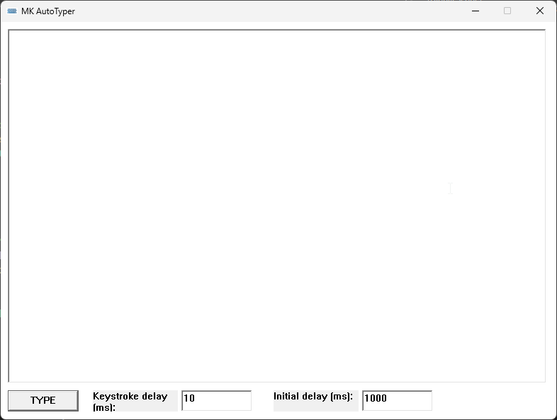

# MK AutoTyper - Data Entry Tool for Windows

Certain applications lack support for copy and paste functionality. 
However, with this application, you can effortlessly simulate keystrokes, eliminating the need for manual typing. It's a real time-saver! 
After all, who enjoys the tedious task of retyping text? Unable to find a lightweight Windows alternative, I took it upon myself to develop one.

## Screenshot

## Releases
https://github.com/mkanzler/MK-Autotyper/releases

## Requirements:
- English or German keyboard layout => Other layouts are not tested, some special charcters may break this programm
- Tested on Windows 11 (Should run on other windows versions as well, as this programm has not many dependencies)
