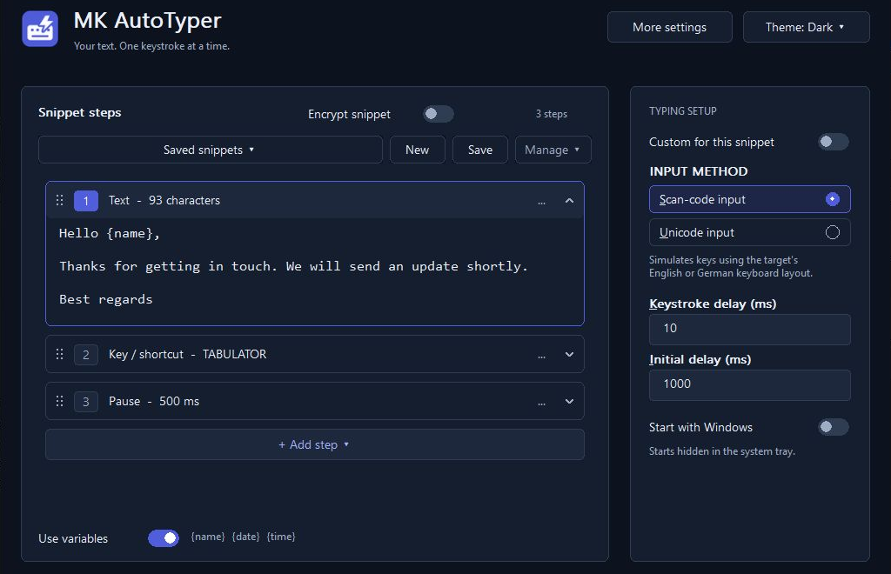
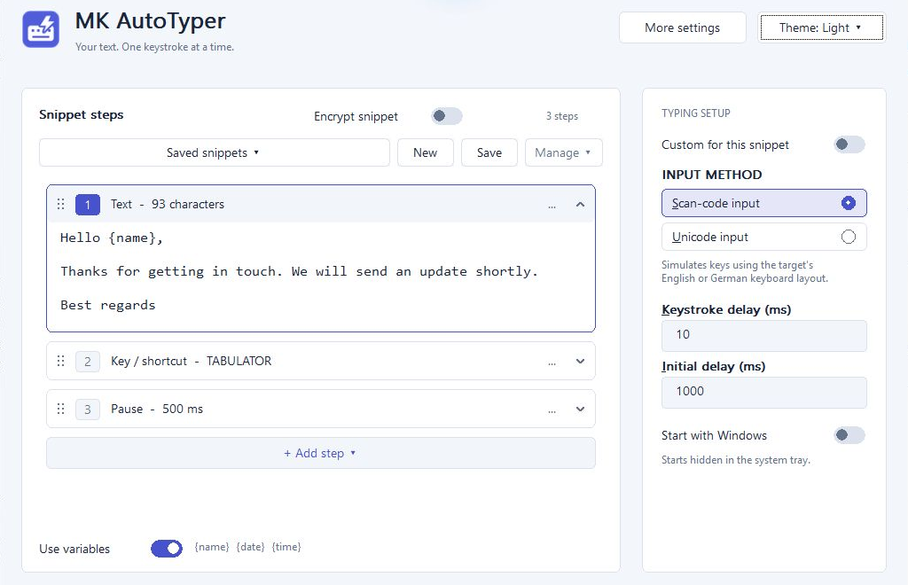

<h1 align="center">MK AutoTyper</h1>

A lightweight Windows app for typing text, building action sequences, and reusing secure snippets.

<strong>Windows 10 / 11</strong> &nbsp;·&nbsp; <strong>x64 &amp; x86</strong> &nbsp;·&nbsp; <strong>Portable</strong>

  <a href="https://github.com/mkanzler/MK-Autotyper/releases/download/release-2.1/MK-AutoTyper-v2.1-windows-x64.exe"><strong>Download x64 EXE</strong></a>
  &nbsp;·&nbsp; <a href="https://github.com/mkanzler/MK-Autotyper/releases/download/release-2.1/MK-AutoTyper-v2.1-windows-x86.exe">x86 EXE</a>
  &nbsp;·&nbsp; <a href="https://github.com/mkanzler/MK-Autotyper/releases/tag/release-2.1">ZIPs and source</a>
  &nbsp;·&nbsp; <a href="docs/user-guide.md">User guide</a>
  &nbsp;·&nbsp; <a href="docs/releases/v2.1.md">Release notes</a>
  &nbsp;·&nbsp; <a href="https://github.com/mkanzler/MK-Autotyper/issues">Report an issue</a>

<picture>
  <source media="(prefers-color-scheme: dark)" srcset="docs/images/card-editor-dark.png">
  <source media="(prefers-color-scheme: light)" srcset="docs/images/card-editor-light.png">
  
</picture>

## What it does

| Feature | How it helps |
| --- | --- |
| **Type into other apps** | Send text as keystrokes with adjustable start and character delays. Choose scan-code or Unicode input. |
| **Build action sequences** | Mix text, keys, shortcuts and timed pauses in visible cards. Drag steps to reorder them; expand a card to edit it. |
| **Fill in variables** | Enter shared fields once before typing, with local date/time placeholders. |
| **Set snippet preferences** | Override input mode and delays for an individual snippet. |
| **Reuse saved snippets** | Save common replies, commands, or text. Find a snippet by name and start it from a keyboard overlay. |
| **Protect sensitive snippets** | Encrypt content with a master password. Prompt each time, or optionally unlock on first use until you lock the vault or exit. The password is never cached. |
| **Start and stop quickly** | Use one configurable global shortcut for clipboard typing and stopping an active session. |
| **Choose your appearance** | Use light mode, dark mode, or follow Windows automatically. |
| **Keep it in the tray** | Close to the system tray or start with Windows in the background. |

Built with native Windows controls. No installer, browser extension, service, or separate C++ runtime installation is required.

## Get started

1. Download the **x64 EXE** for most PCs, or the **x86 EXE** for 32-bit Windows, from the [v2.1 release](https://github.com/mkanzler/MK-Autotyper/releases/tag/release-2.1).
2. Save the EXE in a permanent folder and run it. Optional ZIP bundles contain the same app, license and quick-start guide; extract a ZIP before running **MK-AutoTyper.exe**.
3. Enter text, choose the delays, click **Start typing**, and focus the destination before the countdown finishes.

To use saved snippets, press **Save** in the editor. From another app, press **Ctrl+Alt+P**, search by name, and press **Enter**. The first match is selected automatically.

| Default shortcut | Action |
| --- | --- |
| **Ctrl+Alt+V** | Type clipboard text, or stop the current session |
| **Ctrl+Alt+P** | Search and type a saved snippet |
| **Ctrl+S** | Save the current snippet |
| **Ctrl+N** | Start a new snippet |
| **Ctrl+Tab** | Insert a tab character in the editor |

Change the two global shortcuts in **More settings**. English US/UK and German keyboard layouts are supported. Tab, Enter and Backspace keep their normal behavior in the destination app.

## Build a sequence

Start with the text card, then use **+ Add step** to insert a **Key / shortcut** or **Pause**. Text fields grow as you type. Key and pause cards show their action while collapsed; click their header to edit, and drag the grip to change the order.

- **Choose keys easily:** record a shortcut, search for a key, or combine it with Ctrl, Alt, Shift and Windows. Use Alt+Up/Down on a card header to reorder with the keyboard.
- **Personalize text:** turn on **Use variables** for fields such as `{name}` and the local `{date}` / `{time}`. Repeated fields are entered once before typing.
- **Tune individual snippets:** enable **Custom for this snippet** to save its input method and delays separately from your global settings.
- **Unlock when needed:** optionally enable **Unlock encrypted snippets for this session** in **More settings**. The first protected operation asks for the master password. Use **Lock encrypted snippets** or exit to end the session.

See the [user guide](docs/user-guide.md) for variables, ordering, playback and encrypted snippets, and [security and storage](docs/security.md) for session-unlock details.

## Light and dark

<table>
  <tr>
    <td width="50%"> <strong>Dark</strong></td>
    <td width="50%"> <strong>Light</strong></td>
  </tr>
</table>

The first launch follows Windows. Your theme, delays, shortcuts, and window position are saved per user.

## Documentation

- [User guide](docs/user-guide.md) — typing, snippets, shortcuts, startup, and troubleshooting.
- [Security and storage](docs/security.md) — encryption, local data, and limitations.
- [Build from source](docs/building.md) — Visual Studio setup and release packaging.
- [Developer documentation](docs/README.md) — architecture, file format, and testing.

## License

Copyright © 2024–2026 Marcel Kanzler. Licensed under [GNU GPLv3](LICENSE), version 3 only (`GPL-3.0-only`). You may use, modify and redistribute the app under those terms. It is provided without warranty. Each executable embeds the license; the release also provides the license file and corresponding source archive.
