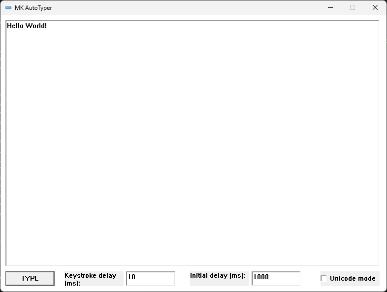

# MK AutoTyper - Data Entry Tool for Windows

Certain applications lack support for copy and paste functionality. 
However, with this application, you can effortlessly simulate keystrokes, eliminating the need for manual typing. It's a real time-saver! 
After all, who enjoys the tedious task of retyping text? Unable to find a lightweight Windows alternative, I took it upon myself to develop one.

## Screenshot

## Features
- Shortcut Ctrl+Alt+V -> Simulates key strokes of the current clipboard content
- Parameter /tray -> Runs in background with systray icon. Perfect for an autostart shortcut!
- Parameter /minimized -> Startup as minimized window
- Customaziable startup and type delay speed
- Unicode character support
- Light way, fast and easy to use

## Releases
https://github.com/mkanzler/MK-Autotyper/releases

## Requirements:
Should run on most recent Windows versions without any requriements (Tested on Windows 11)
